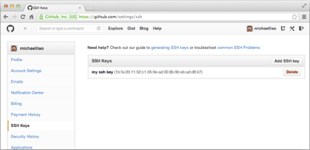
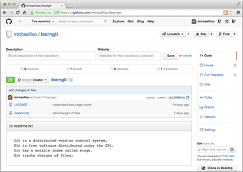
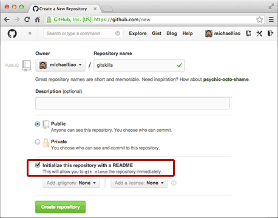
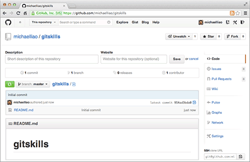

# 远程仓库

到目前为止，我们已经掌握了如何在Git仓库里对一个文件进行时光穿梭，你再也不用担心文件备份或者丢失的问题了。

可是有用过集中式版本控制系统SVN的童鞋会站出来说，这些功能在SVN里早就有了，没看出Git有什么特别的地方。

没错，如果只是在一个仓库里管理文件历史，Git和SVN真没啥区别。为了保证你现在所学的Git物超所值，将来绝对不会后悔，同时为了打击已经不幸学了SVN的童鞋，本章开始介绍Git的杀手级功能之一（注意是之一，也就是后面还有之二，之三……）：远程仓库。

Git是分布式版本控制系统，同一个Git仓库，可以分布到不同的机器上。怎么分布呢？最早，肯定只有一台机器有一个原始版本库，此后，别的机器可以“克隆”这个原始版本库，而且每台机器的版本库其实都是一样的，并没有主次之分。

你肯定会想，至少需要两台机器才能玩远程库不是？但是我只有一台电脑，怎么玩？

其实一台电脑上也是可以克隆多个版本库的，只要不在同一个目录下。不过，现实生活中是不会有人这么傻的在一台电脑上搞几个远程库玩，因为一台电脑上搞几个远程库完全没有意义，而且硬盘挂了会导致所有库都挂掉，所以我也不告诉你在一台电脑上怎么克隆多个仓库。

实际情况往往是这样，找一台电脑充当服务器的角色，每天24小时开机，其他每个人都从这个“服务器”仓库克隆一份到自己的电脑上，并且各自把各自的提交推送到服务器仓库里，也从服务器仓库中拉取别人的提交。

完全可以自己搭建一台运行Git的服务器，不过现阶段，为了学Git先搭个服务器绝对是小题大作。好在这个世界上有个叫GitHub的神奇的网站，从名字就可以看出，这个网站就是提供Git仓库托管服务的，所以，只要注册一个GitHub账号，就可以免费获得Git远程仓库。

在继续阅读后续内容前，请自行注册GitHub账号。由于你的本地Git仓库和GitHub仓库之间的传输是通过SSH加密的，所以，需要一点设置：

第1步：创建SSH Key。在用户主目录下，看看有没有.ssh目录，如果有，再看看这个目录下有没有id_rsa和id_rsa.pub这两个文件，如果已经有了，可直接跳到下一步。如果没有，打开Shell（Windows下打开Git Bash），创建SSH Key：
```
$ ssh-keygen -t rsa -C "youremail@example.com"
```
你需要把邮件地址换成你自己的邮件地址，然后一路回车，使用默认值即可，由于这个Key也不是用于军事目的，所以也无需设置密码。

如果一切顺利的话，可以在用户主目录里找到.ssh目录，里面有id_rsa和id_rsa.pub两个文件，这两个就是SSH Key的秘钥对，id_rsa是私钥，不能泄露出去，id_rsa.pub是公钥，可以放心地告诉任何人。

第2步：登陆GitHub，打开“Account settings”，“SSH Keys”页面：

然后，点“Add SSH Key”，填上任意Title，在Key文本框里粘贴id_rsa.pub文件的内容：


点“Add Key”，你就应该看到已经添加的Key：



为什么GitHub需要SSH Key呢？因为GitHub需要识别出你推送的提交确实是你推送的，而不是别人冒充的，而Git支持SSH协议，所以，GitHub只要知道了你的公钥，就可以确认只有你自己才能推送。

当然，GitHub允许你添加多个Key。假定你有若干电脑，你一会儿在公司提交，一会儿在家里提交，只要把每台电脑的Key都添加到GitHub，就可以在每台电脑上往GitHub推送了。

最后友情提示，在GitHub上免费托管的Git仓库，任何人都可以看到喔（但只有你自己才能改）。所以，不要把敏感信息放进去。

如果你不想让别人看到Git库，有两个办法，一个是交点保护费，让GitHub把公开的仓库变成私有的，这样别人就看不见了（不可读更不可写）。另一个办法是自己动手，搭一个Git服务器，因为是你自己的Git服务器，所以别人也是看不见的。这个方法我们后面会讲到的，相当简单，公司内部开发必备。

确保你拥有一个GitHub账号后，我们就即将开始远程仓库的学习。

小结

“有了远程仓库，妈妈再也不用担心我的硬盘了。”——Git点读机


## 添加远程库

现在的情景是，你已经在本地创建了一个Git仓库后，又想在GitHub创建一个Git仓库，并且让这两个仓库进行远程同步，这样，GitHub上的仓库既可以作为备份，又可以让其他人通过该仓库来协作，真是一举多得。

首先，登陆GitHub，然后，在右上角找到“Create a new repo”按钮，创建一个新的仓库：


在Repository name填入learngit，其他保持默认设置，点击“Create repository”按钮，就成功地创建了一个新的Git仓库：


目前，在GitHub上的这个learngit仓库还是空的，GitHub告诉我们，可以从这个仓库克隆出新的仓库，也可以把一个已有的本地仓库与之关联，然后，把本地仓库的内容推送到GitHub仓库。

现在，我们根据GitHub的提示，在本地的learngit仓库下运行命令：
```
$ git remote add origin git@github.com:michaelliao/learngit.git
```
请千万注意，把上面的michaelliao替换成你自己的GitHub账户名，否则，你在本地关联的就是我的远程库，关联没有问题，但是你以后推送是推不上去的，因为你的SSH Key公钥不在我的账户列表中。

添加后，远程库的名字就是origin，这是Git默认的叫法，也可以改成别的，但是origin这个名字一看就知道是远程库。

下一步，就可以把本地库的所有内容推送到远程库上：
```
$ git push -u origin master
Counting objects: 19, done.
Delta compression using up to 4 threads.
Compressing objects: 100% (19/19), done.
Writing objects: 100% (19/19), 13.73 KiB, done.
Total 23 (delta 6), reused 0 (delta 0)
To git@github.com:michaelliao/learngit.git
 * [new branch]      master -> master
Branch master set up to track remote branch master from origin.
```
把本地库的内容推送到远程，用git push命令，实际上是把当前分支master推送到远程。

由于远程库是空的，我们第一次推送master分支时，加上了-u参数，Git不但会把本地的master分支内容推送的远程新的master分支，还会把本地的master分支和远程的master分支关联起来，在以后的推送或者拉取时就可以简化命令。

推送成功后，可以立刻在GitHub页面中看到远程库的内容已经和本地一模一样：



从现在起，只要本地作了提交，就可以通过命令：
```
$ git push origin master
```
把本地master分支的最新修改推送至GitHub，现在，你就拥有了真正的分布式版本库！

SSH警告

当你第一次使用Git的clone或者push命令连接GitHub时，会得到一个警告：
```
The authenticity of host 'github.com (xx.xx.xx.xx)' can't be established.
RSA key fingerprint is xx.xx.xx.xx.xx.
Are you sure you want to continue connecting (yes/no)?
```
这是因为Git使用SSH连接，而SSH连接在第一次验证GitHub服务器的Key时，需要你确认GitHub的Key的指纹信息是否真的来自GitHub的服务器，输入yes回车即可。

Git会输出一个警告，告诉你已经把GitHub的Key添加到本机的一个信任列表里了：
```
Warning: Permanently added 'github.com' (RSA) to the list of known hosts.
```
这个警告只会出现一次，后面的操作就不会有任何警告了。

如果你实在担心有人冒充GitHub服务器，输入yes前可以对照GitHub的RSA Key的指纹信息是否与SSH连接给出的一致。

小结

要关联一个远程库，使用命令git remote add origin git@server-name:path/repo-name.git；

关联后，使用命令git push -u origin master第一次推送master分支的所有内容；

此后，每次本地提交后，只要有必要，就可以使用命令git push origin master推送最新修改；

分布式版本系统的最大好处之一是在本地工作完全不需要考虑远程库的存在，也就是有没有联网都可以正常工作，而SVN在没有联网的时候是拒绝干活的！当有网络的时候，再把本地提交推送一下就完成了同步，真是太方便了！

## 从远程库克隆

上次我们讲了先有本地库，后有远程库的时候，如何关联远程库。

现在，假设我们从零开发，那么最好的方式是先创建远程库，然后，从远程库克隆。

首先，登陆GitHub，创建一个新的仓库，名字叫gitskills：



我们勾选Initialize this repository with a README，这样GitHub会自动为我们创建一个README.md文件。创建完毕后，可以看到README.md文件：



现在，远程库已经准备好了，下一步是用命令git clone克隆一个本地库：
```
$ git clone git@github.com:michaelliao/gitskills.git
Cloning into 'gitskills'...
remote: Counting objects: 3, done.
remote: Total 3 (delta 0), reused 0 (delta 0)
Receiving objects: 100% (3/3), done.

$ cd gitskills
$ ls
README.md
```
注意把Git库的地址换成你自己的，然后进入gitskills目录看看，已经有README.md文件了。


 如果有多个人协作开发，那么每个人各自从远程克隆一份就可以了。

你也许还注意到，GitHub给出的地址不止一个，还可以用https://github.com/michaelliao/gitskills.git这样的地址。实际上，Git支持多种协议，默认的git://使用ssh，但也可以使用https等其他协议。

使用https除了速度慢以外，还有个最大的麻烦是每次推送都必须输入口令，但是在某些只开放http端口的公司内部就无法使用ssh协议而只能用https。

小结

要克隆一个仓库，首先必须知道仓库的地址，然后使用git clone命令克隆。

Git支持多种协议，包括https，但通过ssh支持的原生git协议速度最快。
